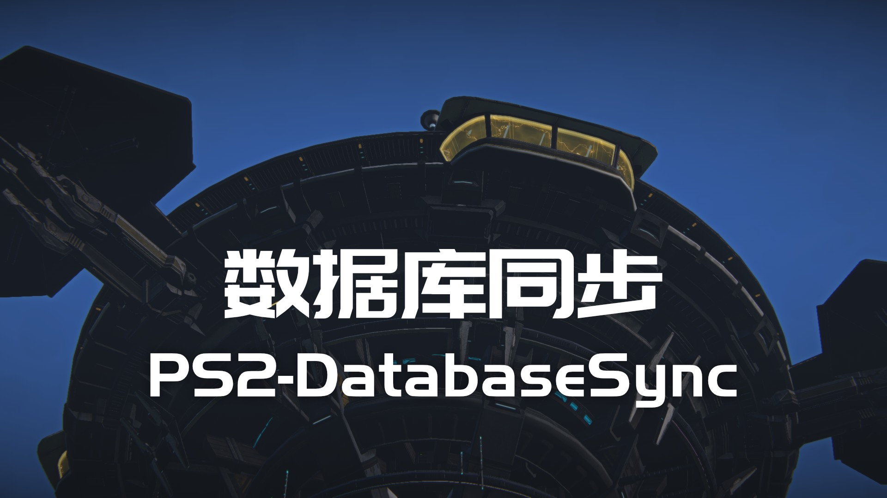

***

<div align="center">


[](https://github.com/PlanetSide2-CPC/PS2-DatabaseSync/issues)
[](https://github.com/PlanetSide2-CPC/PS2-DatabaseSync/blob/master/LICENSE)

</div>

> 基于行星边际 API 的数据库更新系统。

获取 API 返回的消息并更新至数据库。

## 文档

请阅读 [快速入门](README.md#快速入门) 了解如何运行程序，或 [Wiki](https://github.com/PlanetSide2-CPC/PS2-DatabaseSync/wiki) 获得更多信息。

## 功能

- 从 3 个维度自定义配置订阅事件。
- 自适应创建数据库表单。

## 快速入门

项目的简易使用手册。

### 安装依赖

在命令行中使用以下命令安装依赖：

```shell
pip install -r requirements.txt
```

或选择手动安装。

```requirements.txt
setuptools==60.9.0
websockets==10.1
PyMySQL==1.0.2
```

### 配置文件

修改你的 `config.json` 文件:

```json
{
  "source": "mysql",
  "database": {
    "host": "localhost",
    "port": 3306,
    "database": "hydrogen",
    "user": "root",
    "password": "123.com"
  },
  "service": "wss://push.planetside2.com/streaming?environment=ps2&service-id=s:yinxue",
  "events": [
    "Death",
    "FacilityControl",
    "MetagameEvent"
  ],
  "worlds": ["1", "9", "10", "11", "13", "17", "18", "19", "25", "1000", "1001"],
  "character": "all"
}
```

#### 数据库

source: 数据库类型，已支持（Mysql, MongoDB）。

database: 数据库的连接方式，请阅读此 [文档](https://github.com/PlanetSide2-CPC/PS2-DatabaseSync/wiki) 了解更多。

#### 订阅事件

service: 服务 ID，从此 [网页](http://census.daybreakgames.com/) 申请新的 API 链接。

events: 希望订阅的事件，可选 [事件](http://census.daybreakgames.com/#ps2-websocket-examples) 文档。

worlds: 服务器 ID，暂无对应说明。

character: 订阅的玩家，默认 "all" 所有，可使用特定玩家 ID。

### 安装程序

在 `setup.py` 的目录中执行：

```shell
python -m pip install .
```

### 运行程序

使用以下指令运行程序

```shell
python -m hydrogen
```

## 贡献

Issues 追踪: https://github.com/PlanetSide2-CPC/PS2-DatabaseSync/issues

## 状态


